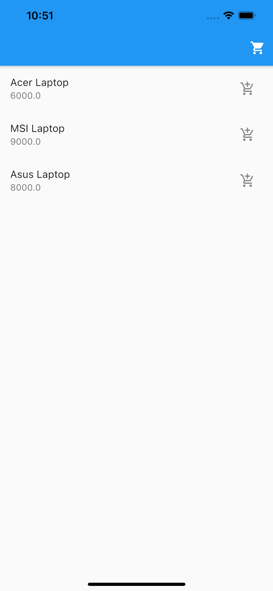
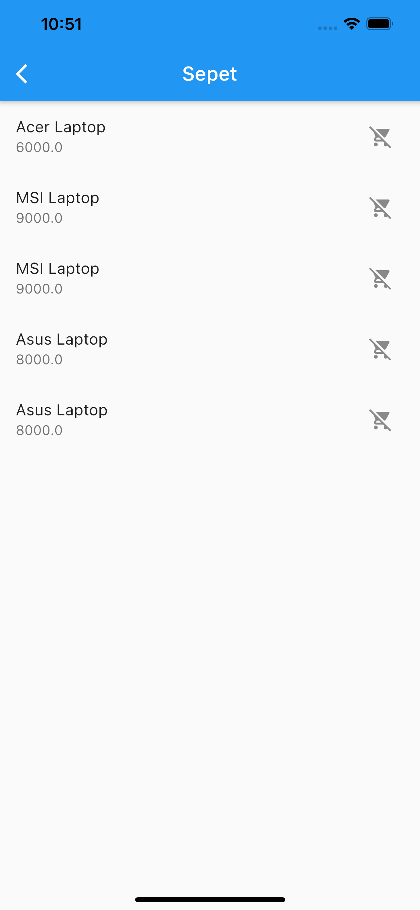

# 
BLoC Shopping

An app that follows The Business Logic Component (BLoC) pattern. The BLoC pattern uses Reactive Programming to handle the flow of data within an app.

Through this project, I've learned:

-   bloc design pattern
-   state management
-   singleton and factory design pattern.

Screenshots of the app:

 &nbsp; &nbsp; &nbsp; &nbsp; &nbsp; 
